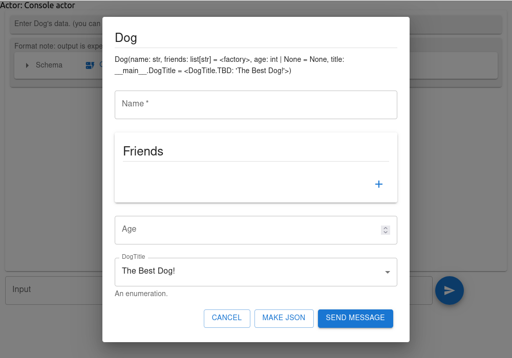

# Web Console Actor

The `WebConsoleActor` facilitates interactive testing of actors, allowing users to dynamically see the observations and manually respond to prompts. This actor serves as an interactive interface without embedded logic; it displays observations to the user in a textual console and, upon receiving a query, prompts the user for input.

When a `expected_type` is specified within a query, the actor presents an automated form, helping to ensure that responses are correctly structured.

## Example

To initialize a web console actor:

```python
actor = WebConsoleActor("Console actor")
```

In a Jupyter notebook, display the console using:

```python
actor.display(height=700)
```

Alternatively, access the web console via a browser by navigating to the URL provided by:

```python
actor.url
```

You can then interact with the actor as demonstrated below:


```python
class DogTitle(enum.Enum):
    GB = "Good boy"
    GG = "Good girl"
    TBD = "The Best Dog!"

@dataclass
class Dog:
    name: str
    friends: list[str] = field(default_factory=list)
    age: int | None = None
    title: DogTitle = DogTitle.TBD

a = actor.query('Enter Dog\'s data. (you can try {"name": "Lassie", "age": 6})', expected_type=Dog)
print(f"Returned: {a!r}")
```

After running query you will get the prompt in web console that allows to create the following dialog on one click:



* The "Send Message" button submits your message directly.
* The "Make JSON" button allows you to preview and verify the final JSON representation of your dialog.